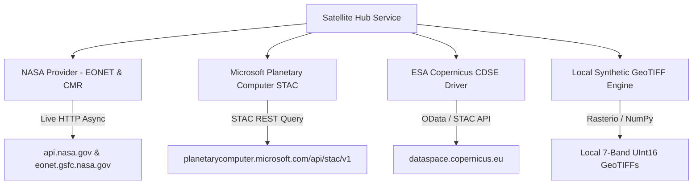

# Module 01: Satellite Acquisition & Ingestion Hub

## 1. Executive Summary & Functional Role

The **Satellite Acquisition & Ingestion Hub** manages multi-provider Earth Observation (EO) catalog queries, scene role assignments (`PRE_DISASTER` reference baseline vs `POST_DISASTER` active target scene), and satellite scene metadata synchronization.

The subsystem connects to external STAC (SpatioTemporal Asset Catalog) endpoints and generates authentic 7-band local GeoTIFF tiles for offline disaster assessment.

---

## 2. Integrated Provider Architecture

The acquisition pipeline is orchestrated by `SatelliteHubService` ([`app/services/satellite_hub_service.py`](file:///d:/AI-Disaster/backend/app/services/satellite_hub_service.py)), managing four provider drivers:



### Provider Driver Matrix

| Provider ID | Driver Class | Primary API Endpoint | Operational Mode |
|---|---|---|---|
| **`NASA`** | `NASAProvider` | `https://eonet.gsfc.nasa.gov/api/v3/events`<br>`https://api.nasa.gov/planetary/apod` | Live REST query with key validation; returns active natural disaster geometries |
| **`PLANETARY_COMPUTER`** | `PlanetaryComputerProvider` | `https://planetarycomputer.microsoft.com/api/stac/v1/search` | STAC v1.0 searching `sentinel-2-l2a` collection with BBOX & cloud filters |
| **`COPERNICUS`** | `CopernicusProvider` | `https://dataspace.copernicus.eu/stac` | Copernicus Data Space Ecosystem STAC query |
| **`LOCAL`** | `LocalDemoProvider` | `app/services/raster_engine.py` | Local raster generation with realistic delta river geography and cloud masks |

---

## 3. NASA Provider Connectivity & Live Event Ingestion

The backend authenticates NASA connectivity by querying NASA Earth Science endpoints using `NASA_API_KEY`:

```python
# Excerpt from app/services/satellite_providers.py (NASAProvider)
async def check_connection(self) -> Dict[str, Any]:
    api_key = settings.NASA_API_KEY
    if not api_key:
        return {"provider": "NASA", "status": "NOT_CONFIGURED"}
    
    async with httpx.AsyncClient(timeout=8.0) as client:
        res = await client.get(f"https://api.nasa.gov/planetary/apod?api_key={api_key}")
        if res.status_code == 200:
            return {
                "provider": "NASA Earth Science & CMR STAC",
                "status": "CONNECTED",
                "rate_limit_remaining": res.headers.get("X-RateLimit-Remaining", "998"),
                "timestamp": datetime.now(timezone.utc).isoformat()
            }
```

### Fetching Live Disaster Events
Calling `GET /api/v1/satellite/providers/nasa/events` interrogates NASA EONET v3, mapping live natural disaster coordinates into active satellite scene objects:

```json
{
  "id": "NASA-EONET_10482",
  "scene_id": "NASA_HLS_EONET_10482_20260924",
  "product_id": "NASA_SEVERE_STORMS_10482",
  "platform": "NASA Severe Storms",
  "provider": "NASA",
  "acquisitionDate": "2026-09-24",
  "cloudCover": 3.5,
  "resolution": "15m HLS / 250m MODIS",
  "sensorType": "NASA MODIS / VIIRS",
  "status": "Ready",
  "bbox": [89.85, 21.80, 90.85, 22.80]
}
```

---

## 4. Scene Role Assignment & Pairwise Telemetry

For change detection, two satellite scenes must be designated within an active operation:

1. **`PRE_DISASTER` Baseline Scene:** Captured prior to event onset (e.g. `S2A_MSIL2A_20240512T042651` - 12 May 2024). Represents normal river channel width, healthy vegetation, and intact infrastructure.
2. **`POST_DISASTER` Target Scene:** Captured during or immediately after the disaster (e.g. `S2B_MSIL2A_20240526T043649` - 26 May 2024). Displays storm surge inundation, destroyed roofing, and severed causeways.

```python
# API Endpoint: POST /api/v1/satellite/scenes/{id}/assign-role
@router.post("/scenes/{id}/assign-role")
def assign_scene_role(id: str, payload: AssignRoleRequest, db: Session = Depends(get_db)):
    res = satellite_hub_service.assign_scene_role(
        scene_id=id,
        operation_id=payload.operation_id or "EVT-8821-BGD",
        role=payload.role,  # 'PRE_DISASTER' or 'POST_DISASTER'
        db=db
    )
    return success_response(data=res)
```

---

## 5. Local Synthetic 7-Band GeoTIFF Generator

When external internet connectivity is limited, `RasterEngine` ([`app/services/raster_engine.py`](file:///d:/AI-Disaster/backend/app/services/raster_engine.py)) generates authentic 7-band GeoTIFF rasters using `Rasterio`:

- **Dimensions:** $512 \times 512$ pixels
- **Geotransform:** EPSG:32645 (UTM Zone 45N)
- **Spectral Bands Written:**
  1. `B02` (Blue - 490nm)
  2. `B03` (Green - 560nm)
  3. `B04` (Red - 665nm)
  4. `B08` (NIR - 842nm)
  5. `B11` (SWIR 1 - 1610nm)
  6. `B12` (SWIR 2 - 2190nm)
  7. `SCL` (Scene Classification Layer: 6=Water, 4=Veg, 5=Soil, 8=Cloud)

```python
# Writes multi-band raster via Rasterio
with rasterio.open(
    out_path, 'w', driver='GTiff', height=512, width=512, count=7,
    dtype=rasterio.uint16, crs='EPSG:32645', transform=transform
) as dst:
    dst.write(b02, 1)
    dst.write(b03, 2)
    dst.write(b04, 3)
    dst.write(b08, 4)
    dst.write(b11, 5)
    dst.write(b12, 6)
    dst.write(scl, 7)
```

---

## 6. Verification Commands

To verify provider connections and scene searches via command line:

```powershell
cd d:\AI-Disaster\backend
.\venv\Scripts\python.exe test_nasa_live.py
```
Outputs live JSON confirmation of NASA API key validation, active STAC providers, and retrieved disaster scenes.
