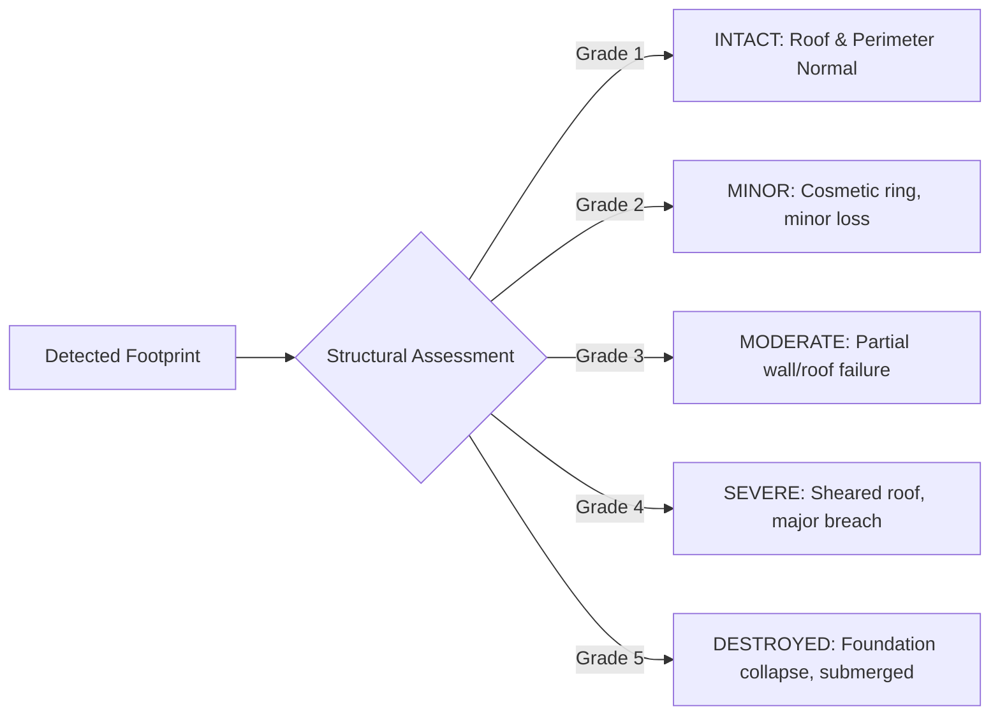

# Module 03: AI Damage Detection Engine

## 1. Executive Summary & Code Architecture

The **AI Damage Detection Engine** ([`app/services/ai_detection_service.py`](file:///d:/AI-Disaster/backend/app/services/ai_detection_service.py)) classifies post-disaster structural building damage, road cut obstructions, and inundation extents.

The operational pipeline categorizes assets according to xBD disaster damage tiers, attaching failure modes, flood depth estimates, confidence scores, and GPS coordinates to each detected feature.

---

## 2. Damage Classification Tiers (xBD Standard)

SentinelAid evaluates structural integrity across five discrete damage grades:



### Grade Hierarchy Table

| Grade ID | Damage Level | Failure Mode Indicator | Rescue Priority Tag | UI Color Code |
|---|---|---|---|---|
| **Grade 1** | **INTACT** | No visible structural deformation | Safe Staging Base | `#10B981` (Emerald) |
| **Grade 2** | **MINOR** | Electrical dry, light water ring ($<0.2\text{m}$) | Inspection Queue | `#3B82F6` (Blue) |
| **Grade 3** | **MODERATE** | Courtyard flooded ($0.6\text{m}$), perimeter breached | Enqueued P2-06 | `#F59E0B` (Amber) |
| **Grade 4** | **SEVERE** | Roof shearing, structural flood ($1.3\text{m}$) | Enqueued P1-01 | `#F97316` (Orange) |
| **Grade 5** | **DESTROYED** | Span washed away, complete inundation ($>2.1\text{m}$) | ROUTE SEVERED / P1 Rescue | `#EF4444` (Crimson) |

---

## 3. Backend Service Implementation

The detection engine runs via `SiameseSegFormerModel` ([`app/services/ai_detection_service.py`](file:///d:/AI-Disaster/backend/app/services/ai_detection_service.py)), returning structured GeoJSON detection records:

```python
# Implementation excerpt from app/services/ai_detection_service.py
class SiameseSegFormerModel(DamageDetectionModel):
    def predict(self, disaster_id: str, confidence_threshold: float = 0.85) -> Dict[str, Any]:
        job_id = f"AI-INF-{uuid.uuid4().hex[:8].upper()}"

        detections = [
            {
                "id": f"det-{uuid.uuid4().hex[:8]}",
                "asset_code": "BLD-8821",
                "location_name": "Coastal District Hospital - Wing B",
                "category": "Medical",
                "object_type": "BUILDING",
                "damage_grade": 4,
                "damage_class": "SEVERE",
                "failure_mode": "Roof Shearing",
                "flood_depth": 1.3,
                "confidence": 96.2,
                "latitude": 21.7439,
                "longitude": 89.3068,
                "rescue_status": "ENQUEUED P1-01"
            },
            {
                "id": f"det-{uuid.uuid4().hex[:8]}",
                "asset_code": "BRG-0019",
                "location_name": "Old Tidal Sluice Causeway Bridge",
                "category": "Transport",
                "object_type": "ROAD",
                "damage_grade": 5,
                "damage_class": "DESTROYED",
                "failure_mode": "Span Washed Away",
                "flood_depth": 2.8,
                "confidence": 98.9,
                "latitude": 21.7381,
                "longitude": 89.2942,
                "rescue_status": "ROUTE SEVERED"
            }
        ]
        return {
            "job_id": job_id,
            "status": "COMPLETED",
            "model_name": self.model_name,
            "total_buildings_analyzed": 4280,
            "severe_collapse": 1126,
            "blocked_road_segments": 42,
            "flood_footprint_km2": 18.6,
            "detections": detections
        }
```

---

## 4. API Endpoints & Request Schemas

### 4.1 Trigger Damage Detection
```http
POST /api/v1/ai/damage-detection
Content-Type: application/json
```
```json
{
  "disaster_id": "evt-remal-001",
  "model_name": "SIAMESE",
  "confidence_threshold": 0.85
}
```

### 4.2 Query AI Operational Status
```http
GET /api/v1/ai/status
```
```json
{
  "success": true,
  "data": {
    "model_name": "ResNet-UNet-v4.2b",
    "framework": "PyTorch",
    "version": "4.2b",
    "status": "READY",
    "inference_engine": "TorchScript TensorRT FP16",
    "model_status": "DEMO_MODEL"
  }
}
```
