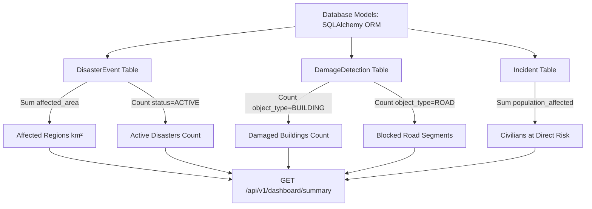

# Module 04: Disaster Command Dashboard & Telemetry Engine

## 1. Executive Purpose & Architecture

The **Disaster Command Dashboard** ([`app/api/dashboard.py`](file:///d:/AI-Disaster/backend/app/api/dashboard.py)) synthesizes database queries across active disaster events, structural damage detections, emergency incident reports, and rescue team assignments into real-time KPI telemetry cards.

The dashboard runs on React 18 with Zustand / React Query state management, querying the FastAPI backend at 10-second auto-refresh intervals.

---

## 2. Real-Time KPI Telemetry Metrics

The backend API computes six high-priority metric indicators:



### Telemetry Breakdown Table

| KPI Telemetry Metric | Database Query Formulation | Typical Value / Output Format |
|---|---|---|
| **Active Disasters** | `db.query(DisasterEvent).filter(DisasterEvent.status == "ACTIVE")` | `"4 Ongoing (1 Critical, 3 Elevated)"` |
| **Affected Regions** | `db.query(func.sum(DisasterEvent.affected_area))` | `"4,500 km² (Coastline & Delta Sector 4)"` |
| **Damaged Buildings** | `db.query(DamageDetection).filter(DamageDetection.object_type == "BUILDING")` | `"1,126 (+14% vs T-24h, 94% AI conf)"` |
| **Blocked Road Segments** | `db.query(DamageDetection).filter(DamageDetection.object_type == "ROAD")` | `"42 Segments (18.4 km network severed)"` |
| **Priority Rescue Zones** | `db.query(Incident).filter(Incident.status.in_(["ACTIVE", "PENDING"]))` | `"7 Priority Sectors"` |
| **Civilians at Direct Risk**| `db.query(func.sum(Incident.population_affected))` | `"4,850 Civilians (Evacuation enqueued)"` |

---

## 3. Backend Endpoint Specifications

### 3.1 Fetch Dashboard Summary
```http
GET /api/v1/dashboard/summary
```

#### Response Example (200 OK)
```json
{
  "success": true,
  "data": {
    "active_disasters": 4,
    "active_disasters_critical": 1,
    "active_disasters_elevated": 3,
    "affected_regions_km2": 4500.0,
    "damaged_buildings": 1126,
    "damaged_buildings_change_percent": 14,
    "damaged_buildings_ai_confidence": 94,
    "blocked_road_segments": 42,
    "blocked_network_km": 18.4,
    "flooded_area_km2": 18.6,
    "priority_rescue_zones": 7,
    "civilians_at_direct_risk": 4850
  }
}
```

---

### 3.2 Fetch Dashboard Telemetry Cards
```http
GET /api/v1/dashboard/metrics
```

#### Response Example (200 OK)
```json
{
  "success": true,
  "data": {
    "activeDisasters": {
      "value": "4 Ongoing",
      "sublabel": "1 Critical, 3 Elevated",
      "icon": "alert-triangle"
    },
    "affectedRegions": {
      "value": "4,500 km²",
      "sublabel": "Coastline & Delta Sector 4",
      "icon": "users"
    },
    "damagedBuildings": {
      "value": "1,126",
      "sublabel": "+14% vs T-24h (94% AI conf)",
      "icon": "building"
    },
    "blockedRoads": {
      "value": "42 Segments",
      "sublabel": "18.4 km network severed",
      "icon": "navigation-2"
    }
  }
}
```

---

## 4. Alert Broadcast & Incident Management

Emergency notifications are registered in the system via `POST /api/v1/alerts`:

```python
# Implementation excerpt from app/api/alerts.py
@router.post("")
def create_alert(req: AlertCreate, db: Session = Depends(get_db)):
    alert = Alert(
        disaster_id=req.disaster_id,
        severity=req.severity,
        title=req.title,
        message=req.message,
        latitude=req.latitude,
        longitude=req.longitude,
        coordinates_str=req.coordinates_str,
        actions_json=req.actions
    )
    db.add(alert)
    db.commit()
    db.refresh(alert)
    return success_response(data={"id": alert.id, "title": alert.title}, message="Alert published")
```
