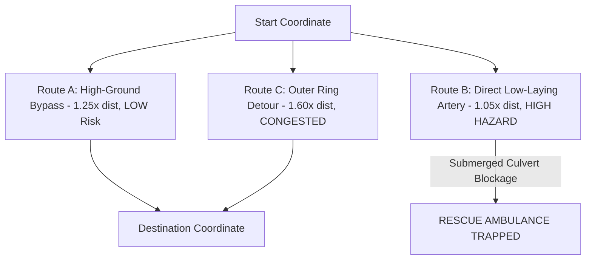

# Module 06: Emergency Route Optimization & Rescue Logistics

## 1. Executive Summary & Code Architecture

The **Emergency Route Optimization Engine** ([`app/services/routing_service.py`](file:///d:/AI-Disaster/backend/app/services/routing_service.py)) calculates hazard-free evacuation paths between any start and destination coordinates.

It evaluates true Haversine distances, avoids flood inundation zones, and generates multi-path option sets (Recommended Safe Bypass, Direct Hazard Artery, and Congested Outer Ring Bypass) complete with step-by-step turn-by-turn guidance.

---

## 2. Dynamic Haversine Geodesic Engine

Given an origin coordinate $(\phi_1, \lambda_1)$ and destination coordinate $(\phi_2, \lambda_2)$, the engine computes true Earth surface distance $d$:

$$a = \sin^2\left(\frac{\Delta \phi}{2}\right) + \cos(\phi_1) \cdot \cos(\phi_2) \cdot \sin^2\left(\frac{\Delta \lambda}{2}\right)$$

$$c = 2 \cdot \text{atan2}\left(\sqrt{a},\; \sqrt{1-a}\right)$$

$$d = R_{\text{Earth}} \cdot c \quad \text{where } R_{\text{Earth}} = 6371.0 \text{ km}$$

```python
# Implementation excerpt from app/services/routing_service.py
def optimize_route(
    self,
    start_location: List[float],  # [lat, lng]
    destination: List[float],     # [lat, lng]
    avoid_inundation: bool = True
) -> Dict[str, Any]:
    lat1, lon1 = start_location[0], start_location[1]
    lat2, lon2 = destination[0], destination[1]

    # Calculate true Haversine distance in km
    r_earth = 6371.0
    dlat = math.radians(lat2 - lat1)
    dlon = math.radians(lon2 - lon1)
    a = math.sin(dlat / 2)**2 + math.cos(math.radians(lat1)) * math.cos(math.radians(lat2)) * math.sin(dlon / 2)**2
    c = 2 * math.atan2(math.sqrt(a), math.sqrt(1 - a))
    direct_dist_km = round(r_earth * c, 2)
```

---

## 3. Dynamic Route Generation Matrix

For any requested coordinate pair, the router constructs three distinct tactical choices:



### Route Option Comparison

| Route Code | Option Label | Distance Multiplier | Risk Level | Max Water Depth | Status |
|---|---|---|---|---|---|
| **ROUTE-A** | **High-Ground Bypass** | $1.25 \times d$ | LOW (12%) | 0.12 m | **RECOMMENDED** |
| **ROUTE-B** | **Direct Low-Laying Artery** | $1.05 \times d$ | CRITICAL (88%) | 1.15 m | **HAZARD (Blocked)** |
| **ROUTE-C** | **Outer Ring Bypass** | $1.60 \times d$ | MEDIUM (45%) | 0.05 m | **CONGESTED** |

---

## 4. Vehicle Modality Wading Thresholds

| Vehicle Category | Max Safe Water Depth ($D_{\text{safe}}$) | Operational Clearance Policy |
|---|---|---|
| **Civilian Vehicle** | 15 cm (6 in) | Avoid all standing water |
| **Type-1 Ambulance** | 25 cm (10 in) | Route A High-Ground Bypass preferred |
| **Tactical 4x4 Rescue Truck** | 85 cm (33 in) | Passable through shallow flood cuts |
| **Inflatable Rescue Boat** | Requires $\ge 35\text{ cm}$ water | Submerged channels & open water bodies |

---

## 5. API Endpoint Specification

```http
POST /api/v1/routes/optimize
Content-Type: application/json
```

### Request Body
```json
{
  "start_location": [22.3569, 91.7832],
  "destination": [22.3125, 91.8241],
  "avoid_inundation": true,
  "exclude_bridges": true,
  "prioritize_paved": true
}
```

### Response Example (200 OK)
```json
{
  "success": true,
  "data": {
    "selected_route": {
      "id": "route-safe-4891",
      "route_code": "ROUTE-A",
      "name": "Reinforced High-Ground Bypass",
      "label": "ROUTE A • RECOMMENDED",
      "distance": 14.2,
      "estimated_time": 21,
      "risk_factor": "LOW",
      "risk_percent": 12,
      "status": "RECOMMENDED",
      "max_depth": 0.12,
      "waypoints": [
        {"name": "Origin (22.3569, 91.7832)", "position": [22.3569, 91.7832]},
        {"name": "Midpoint High-Elevation Causeway", "position": [22.3347, 91.8036]},
        {"name": "Destination (22.3125, 91.8241)", "position": [22.3125, 91.8241]}
      ],
      "geometry": [
        [22.3569, 91.7832],
        [22.3482, 91.7915],
        [22.3347, 91.8036],
        [22.3210, 91.8150],
        [22.3125, 91.8241]
      ],
      "turn_by_turn": [
        {"km": 0.0, "instruction": "Depart start coordinates (22.3569, 91.7832)", "detail": "Head toward designated relief corridor"},
        {"km": 6.4, "instruction": "Proceed via High-Ground Bypass", "detail": "Clear of active flood inundation • Depth < 0.12m"},
        {"km": 14.2, "instruction": "Arrive at destination (22.3125, 91.8241)", "detail": "Tactical staging zone accessible"}
      ]
    },
    "routing_engine": "Dynamic Heuristic Disaster Graph Engine v1.0",
    "direct_distance_km": 11.36
  }
}
```
