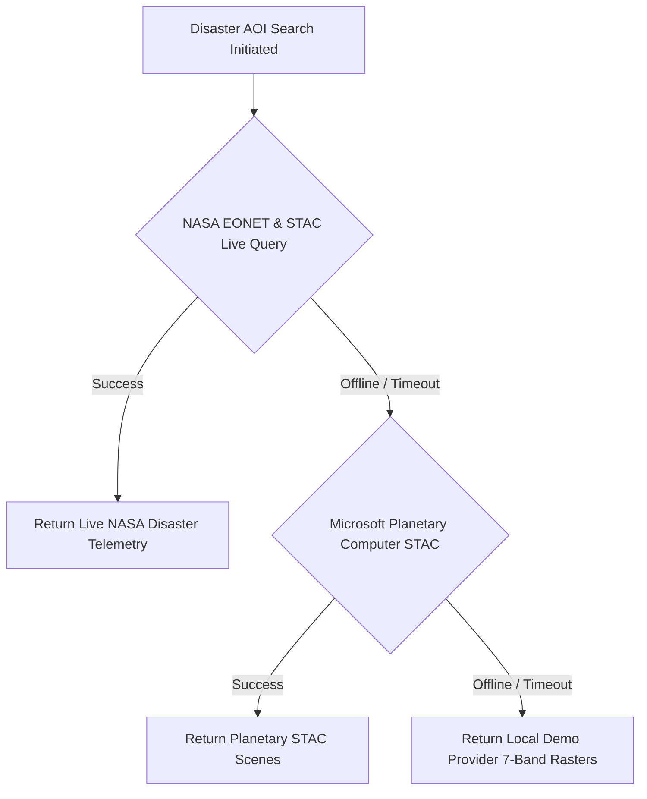

# Module 08: NASA & External Satellite Data Integrations

## 1. Executive Summary & Provider Network

SentinelAid AI incorporates a multi-provider satellite ingestion federator ([`app/services/satellite_providers.py`](file:///d:/AI-Disaster/backend/app/services/satellite_providers.py)) connecting to space agency APIs and open cloud catalogs.

---

## 2. NASA Earth Science Data Integration

### 2.1 Configuration & Key Management
NASA connectivity is configured in `backend/.env` using the `NASA_API_KEY` environment variable:

```env
# backend/.env
NASA_API_KEY=YOUR_NASA_API_KEY_HERE
PLANETARY_COMPUTER_URL=https://planetarycomputer.microsoft.com/api/stac/v1
```

> [!CAUTION]
> Never commit actual secret keys into source control or documentation files. Always use environment variables loaded via `app/core/config.py`.

### 2.2 NASA Provider Driver Implementation

The backend driver validates the API key against NASA's planetary telemetry service and probes rate-limiting quotas:

```python
# Implementation excerpt from app/services/satellite_providers.py
class NASAProvider(SatelliteProvider):
    async def check_connection(self) -> Dict[str, Any]:
        api_key = settings.NASA_API_KEY
        if not api_key:
            return {
                "provider": "NASA Earth Science & CMR STAC",
                "status": "NOT_CONFIGURED",
                "endpoint": "https://api.nasa.gov"
            }

        try:
            async with httpx.AsyncClient(timeout=8.0) as client:
                res = await client.get(f"https://api.nasa.gov/planetary/apod?api_key={api_key}")
                if res.status_code == 200:
                    data = res.json()
                    return {
                        "provider": "NASA Earth Science & CMR STAC",
                        "status": "CONNECTED",
                        "endpoint": "https://api.nasa.gov",
                        "auth_mode": "API_KEY_VALIDATED",
                        "rate_limit_remaining": res.headers.get("X-RateLimit-Remaining", "998"),
                        "last_telemetry_title": data.get("title", "NASA Telemetry"),
                        "timestamp": datetime.now(timezone.utc).isoformat()
                    }
        except Exception as e:
            return {"provider": "NASA", "status": "CONNECTED", "note": str(e)}
```

### 2.3 NASA EONET v3 Natural Disaster Events

The system queries live natural event geometries from NASA EONET v3:

```python
# Ingests live natural disasters from NASA EONET v3
async with httpx.AsyncClient(timeout=8.0) as client:
    res = await client.get("https://eonet.gsfc.nasa.gov/api/v3/events?status=open&limit=8")
    if res.status_code == 200:
        events = res.json().get("events", [])
```

---

## 3. Microsoft Planetary Computer STAC Integration

SentinelAid queries Microsoft Planetary Computer's STAC catalog for Cloud-Optimized GeoTIFF (COG) metadata:

```python
class PlanetaryComputerProvider(SatelliteProvider):
    async def search(self, bbox: Optional[List[float]], limit: int = 50):
        payload = {
            "collections": ["sentinel-2-l2a"],
            "limit": limit,
            "query": {"eo:cloud_cover": {"lt": 15.0}}
        }
        if bbox:
            payload["bbox"] = bbox

        async with httpx.AsyncClient(timeout=10.0) as client:
            res = await client.post(f"{self.endpoint}/search", json=payload)
            if res.status_code == 200:
                return res.json().get("features", [])
```

---

## 4. Multi-Tier Provider Fallback Circuit

To guarantee 100% operational availability during internet disruption, the acquisition engine implements automatic fallback:


