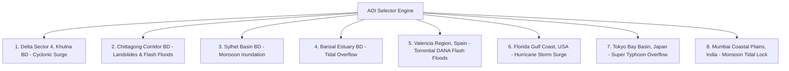

# Module 09: Dynamic Target Places & Custom AOI Engine

## 1. Executive Summary & Code Architecture

The **Dynamic Target Places & Custom AOI Engine** ([`app/api/satellite.py`](file:///d:/AI-Disaster/backend/app/api/satellite.py)) allows incident commanders to switch between global disaster theaters or configure custom operational bounding box coordinates (BBOX) anywhere on Earth.

Updating the active Area of Interest (AOI) dynamically cascades new geographical bounds across the Satellite Acquisition Hub, Spectral Processing Engine, AI Damage Assessment Viewport, GIS Map, and Dynamic Emergency Router.

---

## 2. Curated Global Disaster Presets

SentinelAid includes eight built-in disaster zone presets representing different geographical and disaster profiles:



### Global Presets Coordinates Table

| Preset Name | Region & Country | Lat/Lng Bounding Box (`[min_lon, min_lat, max_lon, max_lat]`) | Primary Hazard Profile |
|---|---|---|---|
| **Delta Sector 4** | Khulna, Bangladesh | `[89.310, 21.540, 90.040, 22.120]` | Cyclonic storm surge, embankment breaching |
| **Chittagong Port** | Chittagong, Bangladesh | `[91.750, 22.250, 91.900, 22.450]` | Coastal storm surge, bridge washouts |
| **Sylhet Basin** | Sylhet, Bangladesh | `[91.780, 24.780, 91.950, 24.980]` | Severe river basin monsoon flooding |
| **Barisal Estuary** | Barisal, Bangladesh | `[90.250, 22.600, 90.450, 22.800]` | Tidal river overflow, island enclave isolation |
| **Valencia Region** | Valencia, Spain | `[-0.450, 39.350, -0.250, 39.550]` | Catastrophic DANA flash flooding |
| **Florida Gulf Coast**| Tampa Bay, USA | `[-82.550, 27.850, -82.350, 28.050]` | Category 4 hurricane storm surge |
| **Tokyo Bay Basin** | Tokyo, Japan | `[139.550, 35.550, 139.750, 35.750]` | Super typhoon urban storm runoff |
| **Mumbai Coast** | Mumbai, India | `[72.750, 18.950, 72.950, 19.150]` | High-tide lock monsoon urban waterlogging |

---

## 3. Custom Coordinate Parsing & Bounding Box Engine

Incident commanders can enter custom latitude and longitude coordinates. The engine validates that:

$$-90.0 \le \text{Latitude} \le +90.0 \quad \text{and} \quad -180.0 \le \text{Longitude} \le +180.0$$

Given a target point $(lat_0, lon_0)$ and a $10\text{ km}$ operational radius:

$$\Delta \text{lat} = \frac{10.0}{111.32} \approx 0.090^\circ$$

$$\Delta \text{lon} = \frac{10.0}{111.32 \cdot \cos(\text{radians}(lat_0))}$$

$$\text{BBOX} = [lon_0 - \Delta \text{lon},\; lat_0 - \Delta \text{lat},\; lon_0 + \Delta \text{lon},\; lat_0 + \Delta \text{lat}]$$

---

## 4. API Endpoints

### 4.1 Configure Target AOI
```http
POST /api/v1/satellite/aoi
Content-Type: application/json
```
```json
{
  "operation_id": "EVT-8821-BGD",
  "bbox": [89.310, 21.540, 90.040, 22.120],
  "region": "Delta Sector 4",
  "incident_name": "Cyclone Remal Inundation"
}
```

### 4.2 Query Active Target AOI
```http
GET /api/v1/satellite/aoi
```
```json
{
  "success": true,
  "data": {
    "operation_id": "EVT-8821-BGD",
    "bbox": [89.310, 21.540, 90.040, 22.120],
    "region": "Delta Sector 4",
    "crs": "EPSG:32645 (WGS 84 / UTM 45N)"
  }
}
```
