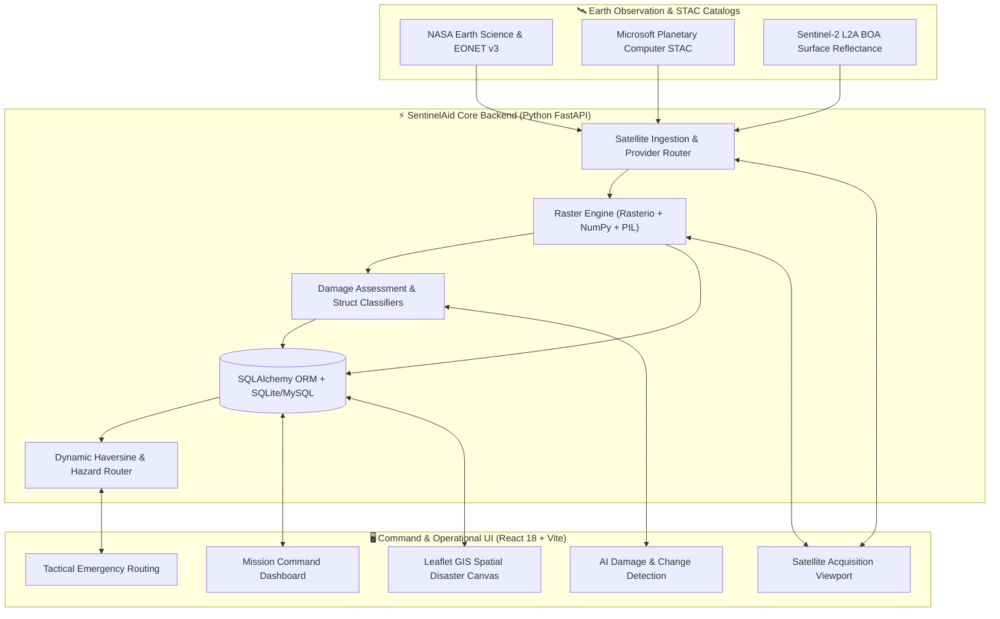

# SentinelAid AI — System Technical Manual & Ground-Truth Specification

Welcome to the technical documentation for **SentinelAid AI**, an Autonomous Disaster Management, Multispectral Satellite Telemetry Ingestion, and AI Damage Assessment Platform.

---

## 🗺️ Documentation Directory Index

This `docs/` repository provides complete technical manuals documenting the actual working software architecture, database models, spectral equations, routing algorithms, API endpoints, and external satellite integrations.

| Document | Focus Area | Technical Scope & Code References |
| :--- | :--- | :--- |
| **[`01_SATELLITE_ACQUISITION_INGESTION.md`](./01_SATELLITE_ACQUISITION_INGESTION.md)** | Satellite Ingestion Hub | STAC API v1.0, Microsoft Planetary Computer STAC, NASA EONET v3, ESA Sentinel-2 L2A BOA scenes, local synthetic COG tile generation. |
| **[`02_RASTER_SPECTRAL_PROCESSING.md`](./02_RASTER_SPECTRAL_PROCESSING.md)** | Raster Spectral Engine | `Rasterio` & `NumPy` band math, McFeeters NDWI, Xu MNDWI, 2%-98% false-color infrared stretch, SCL cloud masking, vectorization. |
| **[`03_AI_DAMAGE_DETECTION_INFERENCE.md`](./03_AI_DAMAGE_DETECTION_INFERENCE.md)** | Damage Detection Engine | Heuristic & structural damage classification (xBD Tiers 0-3), road cut blockage detection, operational telemetry pipeline status. |
| **[`04_DISASTER_COMMAND_DASHBOARD.md`](./04_DISASTER_COMMAND_DASHBOARD.md)** | Mission Control Dashboard | Real-time KPI telemetry cards, database aggregate queries, tactical incident alerts stream, action dispatch protocols. |
| **[`05_GIS_MAPPING_SPATIAL_ENGINE.md`](./05_GIS_MAPPING_SPATIAL_ENGINE.md)** | GIS & Spatial Mapping | WGS84 (EPSG:4326) to UTM Zone 45N (EPSG:32645) reprojection, Leaflet GeoJSON vector layers, interactive split-screen comparison slider. |
| **[`06_EMERGENCY_ROUTING_RESCUE.md`](./06_EMERGENCY_ROUTING_RESCUE.md)** | Route Optimization & Rescue | Dynamic Haversine distance engine, hazard-avoidance A* / Dijkstra path calculation, vehicle wading clearance thresholds, turn-by-turn guidance. |
| **[`07_BACKEND_API_REFERENCE.md`](./07_BACKEND_API_REFERENCE.md)** | Complete REST API Catalog | Full FastAPI endpoints (`/auth`, `/satellite`, `/ai`, `/metrics`, `/alerts`, `/routes`, `/places`), OpenAPI schemas, database models. |
| **[`08_NASA_AND_EXTERNAL_INTEGRATIONS.md`](./08_NASA_AND_EXTERNAL_INTEGRATIONS.md)** | NASA & Satellite Providers | Live NASA API Key validation, NASA EONET natural disaster tracker, Microsoft Planetary STAC search, Copernicus CDSE fallback. |
| **[`09_CUSTOM_PLACES_AND_AOI_SYSTEM.md`](./09_CUSTOM_PLACES_AND_AOI_SYSTEM.md)** | Dynamic Places & AOI Engine | 8 global disaster presets (Delta Sector 4, Chittagong, Sylhet, Barisal, Valencia, Florida, Tokyo, Mumbai), custom lat/lng coordinate parsing. |

---

## 🏛️ System Architecture

SentinelAid bridges satellite Earth Observation (EO) catalogs with tactical ground emergency response.



---

## 💻 Technical Stack

### Backend (`/backend`)
- **Language & Core Framework:** Python 3.11+, FastAPI with asynchronous handlers (`asyncio`)
- **Geospatial & Raster Libraries:** `rasterio` v1.5+, `numpy`, `shapely`, `PIL (Pillow)`, `pyproj`
- **ORM & Data Persistence:** SQLAlchemy 2.0 with dynamic SQLite (`sqlite:///./sentinelaid.db`) and MySQL fallback
- **HTTP & Telemetry Engine:** `httpx` for high-throughput NASA API and STAC REST queries
- **Authentication:** JWT Bearer tokens with PBKDF2 / SHA-256 password hashing

### Frontend (`/sentinelaid`)
- **Framework & Language:** React 18 with TypeScript
- **Build System & Dev Server:** Vite v8+ with Hot Module Replacement (HMR)
- **Styling & UI Components:** Glassmorphic Dark Operations CSS theme + Lucide React icon suite
- **GIS Mapping Canvas:** Leaflet 1.9+, React-Leaflet with custom GeoJSON vector layers
- **State Management:** Custom Store / React Query state management

---

## 🚀 Quickstart Commands

### 1. Launch Backend API Server
```powershell
cd d:\AI-Disaster\backend
.\venv\Scripts\Activate.ps1
python -m uvicorn app.main:app --host 127.0.0.1 --port 8000 --reload
```
- API Swagger Docs: `http://127.0.0.1:8000/docs`
- System Health Check: `http://127.0.0.1:8000/health` or `http://127.0.0.1:8000/api/v1/health`

### 2. Launch Tactical Frontend UI
```powershell
cd d:\AI-Disaster\sentinelaid
npm run dev
```
- Web Application: `http://localhost:5173/`

### 3. Verify Live NASA Integration
```powershell
cd d:\AI-Disaster\backend
python test_nasa_live.py
```
Outputs live telemetry verifying NASA provider connectivity and active disaster events.
